# About App 

- this is a Angular ecommerce application witch provide : 
- authentication using phone number and password + validation.
- using json-server as a backend api (see Services/http.service.ts).
- it use localStorage for saving states .
- these is product detail section.
- it use tailwindCss for styling.
- it provide routing (SPA app).
- images : 

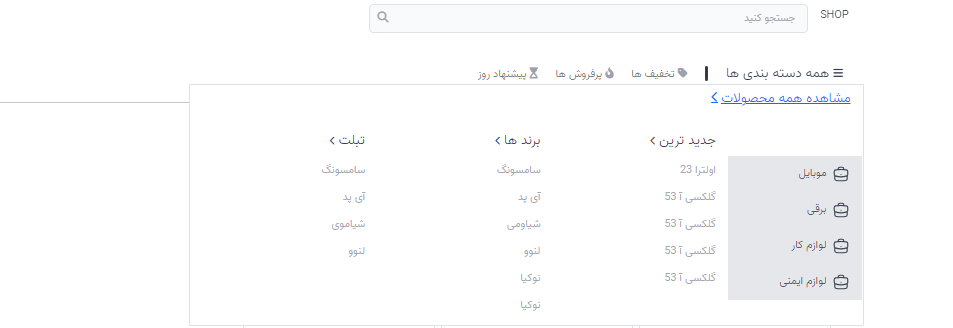
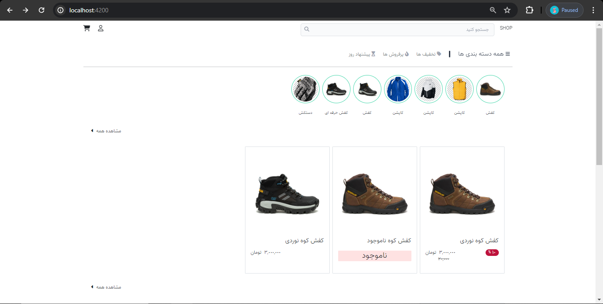
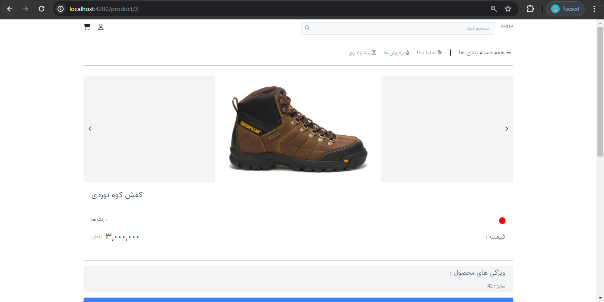
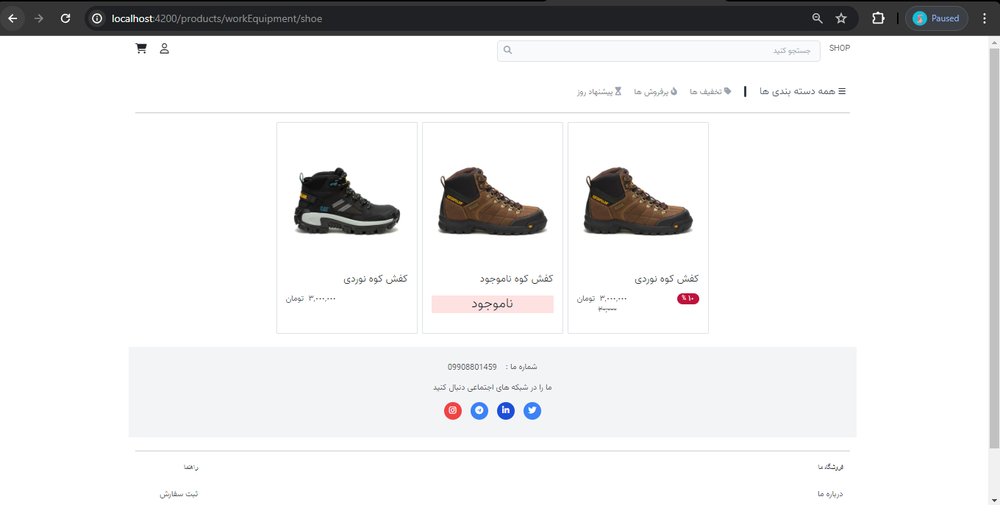
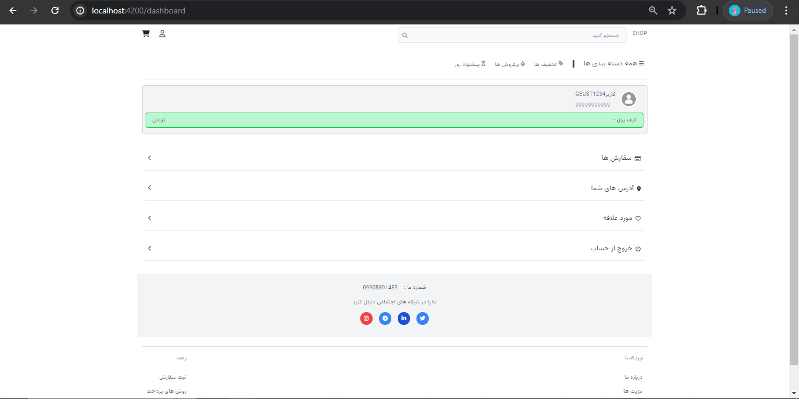
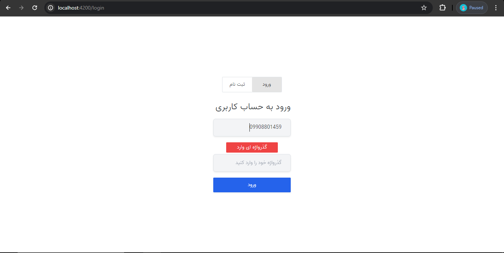
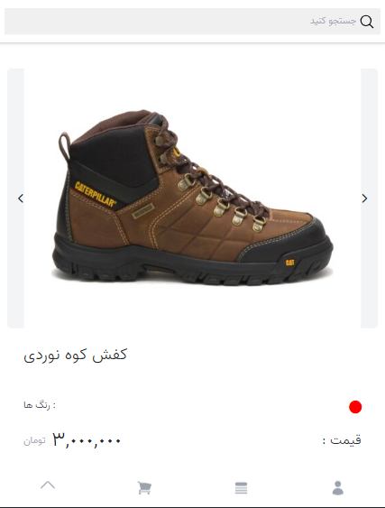
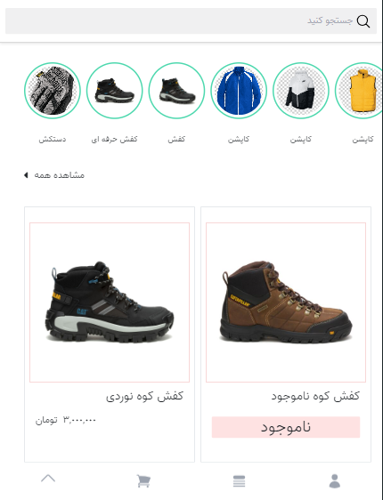
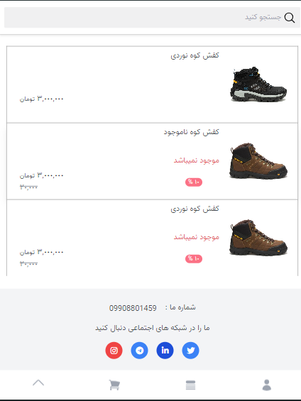
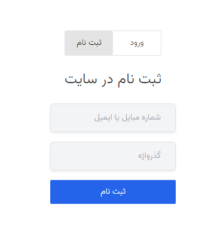

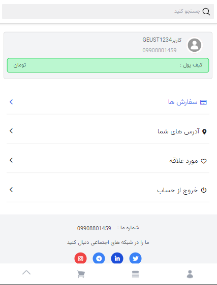
